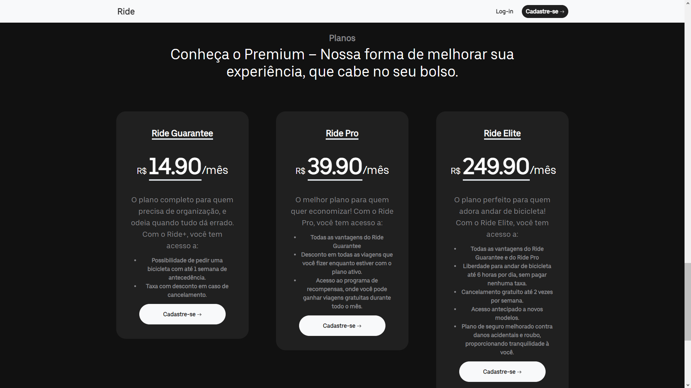
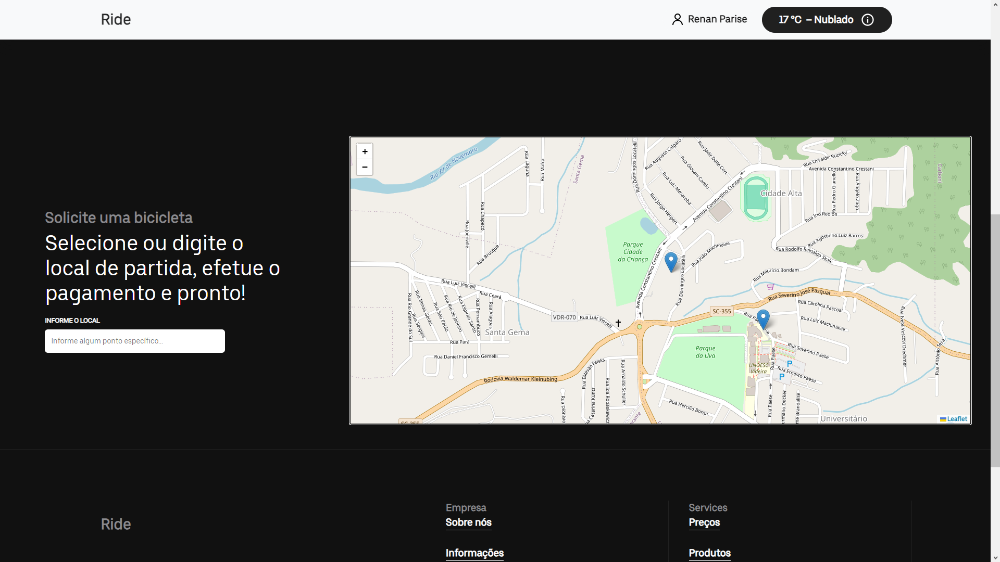

# Ride - Bicycle Sharing App

Ride is a bicycle-sharing app inspired by the convenience of ride-sharing services like Uber. It allows users to easily locate, unlock, and rent bicycles for short trips within the city. The app is built using Python, Flask, and SQLite, providing a simple and efficient solution for sustainable urban transportation.

## Table of Contents
- [Features](#features)
- [Installation](#installation)
- [Run](#run)
- [License](#license)

## Features

- **User Authentication**: Secure user authentication system to ensure the privacy and security of user accounts.
- **Rental Management**: Easy-to-use interface for renting and returning bicycles with transparent pricing.
- **Real-time Weather Condition**: Provides users with the current weather conditions, helping them decide whether it's suitable to ride a bike.
- **Intuitive Map Interface**: User-friendly map interface with location markers to help users easily navigate, select bike pickup points, and view their current position.

## Installation

Follow the steps below to set up and run the Ride app locally:

### Prerequisites

- Python 3.x installed on your machine.
- [Pip](https://pip.pypa.io/en/stable/installation/) for installing Python packages.

### Clone the Repository

```bash
git clone https://github.com/Renan-Parise/projeto-app-ride-main.git
cd projeto-app-ride-main
```

### Create and Activate a Virtual Environment

```bash
python -m venv venv
source venv/bin/activate   # On Windows, use 'venv\Scripts\activate'
```

### Install Dependencies

```bash
pip install -r requirements.txt
```

## Run

Run the Python file and visit http://localhost:5000 in your web browser to access the Ride app.

## License

This project is licensed under the MIT License - see the LICENSE file for details. Feel free to customize this further based on your project's specific details!

## Images





